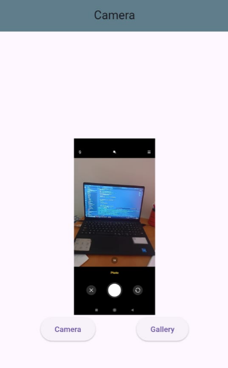

# Flutter Camera & Gallery App

A simple Flutter application built as a learning project to understand the fundamentals of handling camera and image gallery functionalities in a mobile app. This project demonstrates how to capture images using the device's camera and how to select images from the device's photo library.

---

## 📸 Features

* **Camera Integration:** Open the device camera to take a new photo.
* **Gallery Access:** Open the device's image gallery to select an existing photo.
* **Image Display:** Display the selected or captured image within the app.

---

## 🖼️ Screenshot

Here's a look at the app in action:



---

## 💡 What I Learned

This project was a great exercise in understanding several key concepts in Flutter development:

* **State Management:** Managing the state of the image to be displayed on the screen.
* **Flutter Packages:** Integrating and using third-party packages like `image_picker` to interact with native device features.
* **Handling Permissions:** Requesting and handling user permissions for camera and photo library access, which is crucial for modern mobile app development.
* **Asynchronous Programming:** Using `async` and `await` to handle operations like picking an image without blocking the UI.
* **UI Development:** Building a simple and functional user interface with Flutter's widget system.

---

## ⚙️ Setup and Installation

To run this project locally, follow these steps:

1.  **Clone the repository:**
    ```bash
    git clone https://github.com/mahfuzRahman189/Camera-App.git
    ```
2.  **Navigate to the project directory:**
    ```bash
    cd flutter_camera_app
    ```
3.  **Install dependencies:**
    ```bash
    flutter pub get
    ```
4.  **Run the app:**
    ```bash
    flutter run
    ```

---

## 🔐 Required Permissions

For the app to function correctly, especially on iOS, you need to add permissions to the `Info.plist` file. This informs the user why the app needs access to the camera and photo library.

```xml
<key>NSCameraUsageDescription</key>
<string>This app needs camera access to take photos</string>
<key>NSPhotoLibraryUsageDescription</key>
<string>This app needs photo library access to select images</string>
```
### Android

For Android, add the following permission to your `android/app/src/main/AndroidManifest.xml` file. The `image_picker` package may handle this automatically, but it's good practice to declare it.

```xml
<uses-permission android:name="android.permission.CAMERA" />
```

---

## 🛠️ Technologies Used

* **Framework:** Flutter
* **Language:** Dart
* **Key Packages:**
    * `image_picker`

---

## 🙏 Acknowledgements

This project was built while following a tutorial to better understand Flutter. It served as a practical application of the concepts learned.
